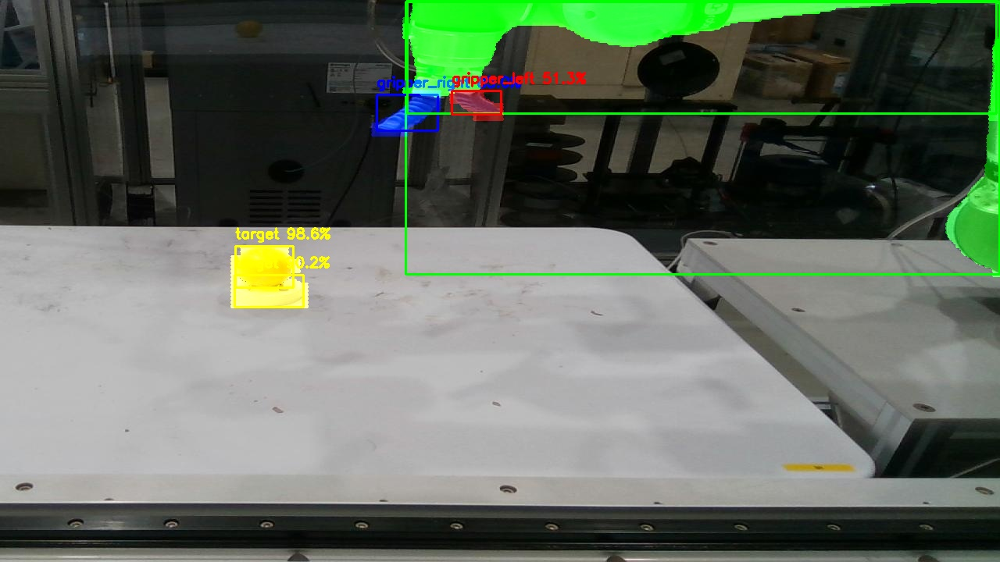
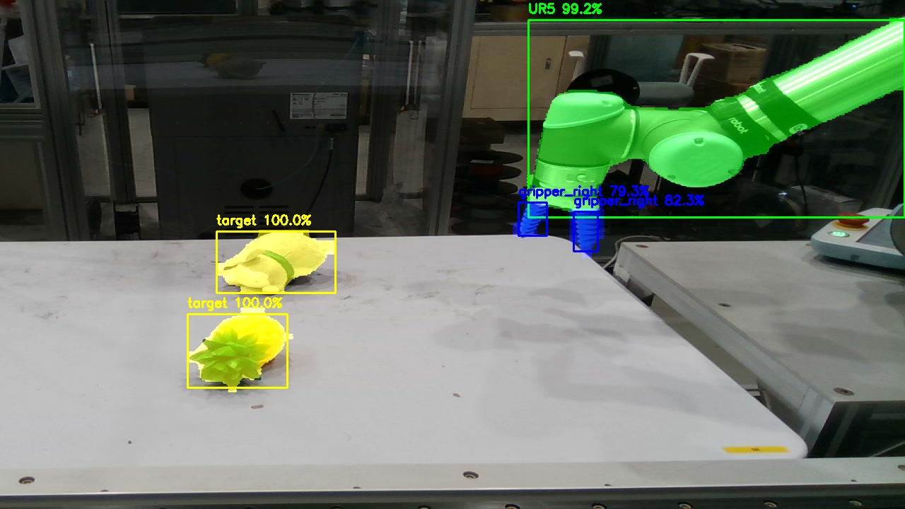
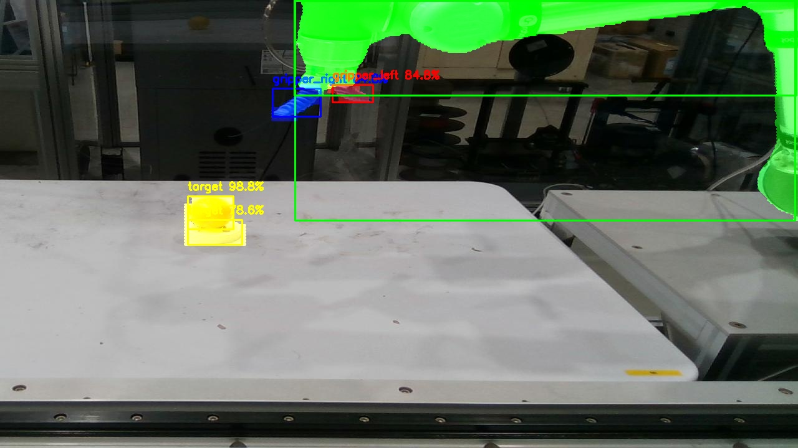
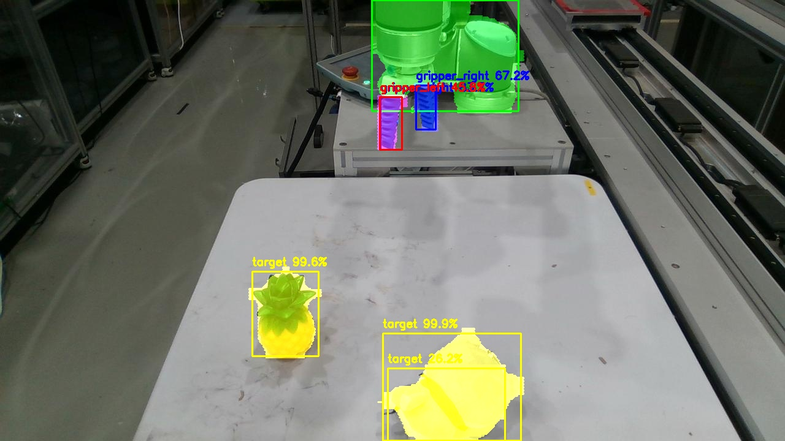
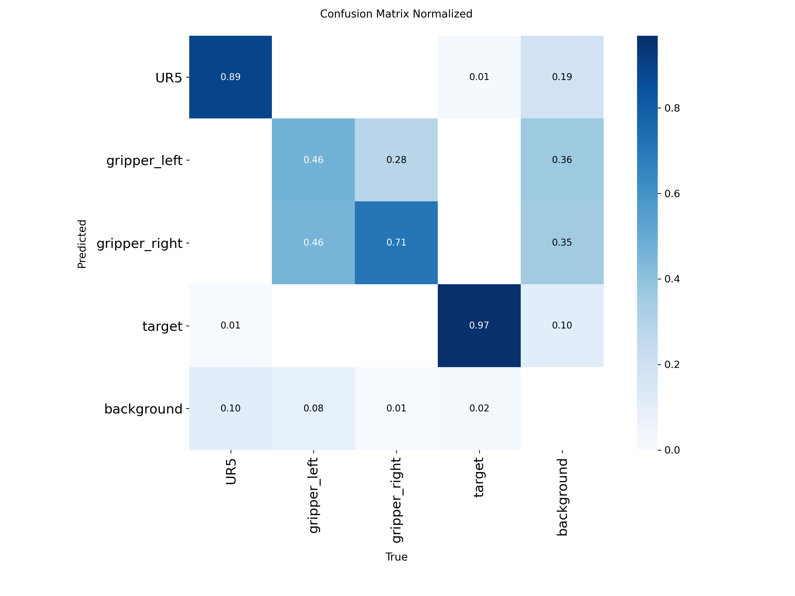
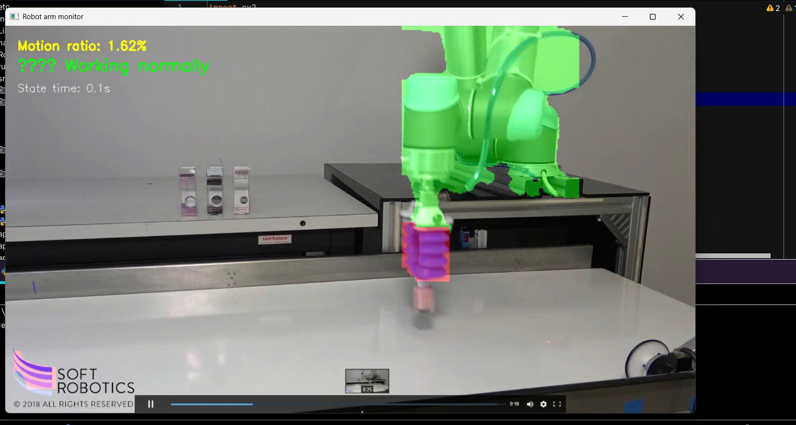

# Robot Gripper Detection and Monitoring System

This project implements a robot gripper detection and monitoring system using YOLOv8 segmentation. The system can detect and track robot arms, grippers, and targets in real-time video, providing motion analysis and status alerts for robotic operations.


## Table of Contents
- [Overview](#overview)
- [Project Structure](#project-structure)
- [Features](#features)
- [Prerequisites](#prerequisites)
- [Installation](#installation)
- [Usage](#usage)
- [Training](#training)
- [Testing/Inference](#testinginference)
- [Configuration](#configuration)
- [Model Information](#model-information)
- [Results](#results)
- [Troubleshooting](#troubleshooting)
- [Docker Support](#docker-support)
- [License](#license)

## Overview

This project leverages the YOLOv8 segmentation model to detect and monitor robot grippers and components in video streams. The system tracks robot motion and provides real-time feedback on operational status, identifying when the robot is stopped, moving slowly, or operating normally.

The trained model can detect the following classes:
- UR5 arm
- Left gripper
- Right gripper
- Target

The system includes motion analysis capabilities that can detect when the robot is stationary or moving slowly for extended periods, triggering alerts when needed.

## Project Structure

```

├── video_test1.mp4          # Test video file 1
├── video_test2.mp4          # Test video file 2
├── video_test3.mp4          # Test video file 3
├── yolov8n-seg.pt           # YOLOv8 segmentation model
├── README.md                # This file
├── .idea/                   # IDE configuration files
├── etc/conda/              # Conda environment configuration
├── include/                 # Header files (C/C++)
├── Lib/                     # Python libraries
├── Robot_gripper/          # Robot gripper dataset with train/valid/test splits
│   ├── data.yaml           # Dataset configuration file
│   ├── train/              # Training data
│   ├── valid/              # Validation data
│   └── test/               # Test data
├── runs/                    # Output directory for training results
├── results/                 # Output directory for inference results
└── src/                     # Source code files
    ├── main.py             # Main entry point with CLI interface
    ├── __init__.py         # Python package initialization
    ├── config/             # Configuration files
    ├── models/             # Model training and testing code
    │   ├── train_robot_seg_yolov8.py  # Training script
    │   └── test.py         # Inference/testing script
    ├── tests/              # Test files
    └── utils/              # Utility functions
        └── video_utils.py  # Video processing utilities
```

## Features

- **Real-time robot gripper detection and segmentation**
- **Motion analysis and tracking**
- **Status monitoring with alerts for stopped or slow movement**
- **Training pipeline for custom robot gripper models**
- **Configurable parameters for detection confidence and motion thresholds**
- **Video resizing and processing capabilities**
- **Visual overlays showing detected components with color coding**

## Prerequisites

Before running this project, ensure you have:

- Python 3.8 or higher
- PyTorch (recommended: 1.9.0 or higher)
- OpenCV (cv2)
- Ultralytics YOLOv8 package
- NumPy
- tqdm for progress bars
- CUDA-compatible GPU (recommended for performance)
- Windows OS (as indicated by the win32 architecture)

## Installation

1. Clone or download this repository to your local machine.

2. Install required Python packages:
   ```bash
   pip install ultralytics opencv-python torch torchvision numpy tqdm
   ```

3. Ensure you have the YOLOv8 segmentation model (`yolov8n-seg.pt`) in the root directory.

4. Verify your installation:
   ```bash
   python -c "import torch; print(torch.__version__)"
   python -c "import cv2; print(cv2.__version__)"
   python -c "from ultralytics import YOLO; print('ULTRALYTICS OK')"
   ```

## Usage

The main entry point provides a command-line interface for different modes:

### Main Program Structure

```bash
python -m src.main [mode] [options]
```

Available modes:
- `train` - Train the robot gripper segmentation model
- `test` - Run inference/monitoring on video
- `evaluate` - Coming soon

### Training

To train the model, run:
```bash
python -m src.main train
```

Or with specific parameters:
```bash
python -m src.models.train_robot_seg_yolov8 --model yolov8n-seg.pt --data Robot_gripper/data.yaml --epochs 30 --batch 2 --imgsz 512
```

### Testing/Inference

To run inference on a video:
```bash
python -m src.main test
```

Or with specific parameters:
```bash
python -m src.models.test --source video_test1.mp4 --checkpoint runs/segment/robot_gripper/weights/best.pt --output results/robot_monitor_output1.mp4 --conf 0.25
```

## Training

The training script (`src/models/train_robot_seg_yolov8.py`) trains a YOLOv8 segmentation model on robot gripper data.

### Training Parameters
- `--model, -m`: Model to use (default: yolov8n-seg.pt)
- `--data, -d`: Dataset configuration file (default: Robot_gripper/data.yaml)
- `--epochs, -e`: Number of training epochs (default: 30)
- `--imgsz, -i`: Image size for training (default: 512)
- `--batch, -b`: Batch size (default: 2)
- `--workers, -w`: Number of worker threads (default: 0)
- `--device, -dev`: Device to use (default: 0)
- `--optimizer, -opt`: Optimizer (default: SGD)
- `--lr0`: Initial learning rate (default: 0.001)
- `--patience`: Patience for early stopping (default: 20)
- `--amp`: Use automatic mixed precision
- `--cache`: Cache mode (default: "ram")
- `--project, -p`: Project name (default: "runs/segment")
- `--name, -n`: Run name (default: "robot_gripper")

## Testing/Inference

The testing script (`src/models/test.py`) performs inference on video files to detect and track robot grippers.

### Inference Parameters
- `--source, -s`: Video source (default: video_test2.mp4)
- `--checkpoint, -c`: Model checkpoint to use (default: runs/segment/robot_gripper/weights/best.pt)
- `--output, -o`: Output file path (default: results/robot_monitor_output2.mp4)
- `--scale, -sc`: Scale factor for video resizing (default: 0.6)
- `--conf`: Confidence threshold (default: 0.25)
- `--threshold-stop`: Threshold for detecting stopped motion (default: 1.0)
- `--threshold-slow`: Threshold for detecting slow motion (default: 4.0)
- `--alert-delay`: Delay for alerts (default: 3.0)

### Motion Analysis
The system analyzes motion between frames by comparing segmentation masks of robot components:
- **Active**: Normal motion
- **Stopped**: Motion below threshold-stop
- **Slow**: Motion between threshold-stop and threshold-slow
- **Stopped for long time**: When stopped for longer than alert-delay

## Configuration

### Dataset Configuration

The `Robot_gripper/data.yaml` file defines the dataset structure:
```yaml
train: ../train/images
val: ../valid/images
test: ../test/images
nc: 4  # Number of classes
names: ['UR5', 'gripper_left', 'gripper_right', 'target']
```

### Class Colors

The model uses specific colors for each detected class:
- UR5 arm: Green (0, 255, 0)
- Left gripper: Red (0, 0, 255)
- Right gripper: Red (0, 0, 255)
- Target: Light blue (255, 255, 0)

## Model Information

- **Model Name**: YOLOv8n-seg.pt (or custom trained robot gripper model)
- **Type**: Instance Segmentation Model
- **Size**: Nano (n) variant
- **Purpose**: Robot gripper detection and segmentation
- **Classes**: 4 (UR5 arm, left gripper, right gripper, target)
- **Input**: Video frames
- **Output**: Segmentation masks, bounding boxes, class labels, and confidence scores

##Results

Includes system outputs:

###Result Trainer
- Model saved in `runs/segment/robot_gripper/weights/`
- Training log and metrics in `runs/segment/robot_gripper/`
- Best model saved as `best.pt`

### Expected results
- Marked video saved in `results/`
- Live overlay showing detected components in color code
- Motion analysis and status information displayed on video
- Status warning when robot stops or slows

### Information header displayed
- Proportional motion percentage
- Current operating state (normal, pause, slow, long stop)
- Time status
- Segment mask with color code

### Illustration of results results

Here are some images illustrating the results detected by the model:










####  Quick Results
| Grade | Accuracy | Notes |
|------|---------------|---------|
| UR5 Arm | ~0.89 | Good, stable detection |
| Left Clamp | ~0.28 | Easily confused with right clamp |
| Right Clamp | ~0.71 | Fairly good detection |
| Target | ~0.97 | Almost perfect |

####  Comments
- The model performs **best with UR5 and Target**.

- The two clamps are similar in shape so **it gets a little confusing**.

- Could be improved by **increasing training data** and **adding reinforcement**.

Overall, the model is **high performing** and robust enough for **real-time industrial robot monitoring**.





###  Video Test


## Troubleshooting

### Common Issues:

1. **CUDA Error**: If you encounter CUDA errors, ensure your GPU drivers are up to date and PyTorch is installed with CUDA support.
   ```bash
   pip install torch torchvision torchaudio --index-url https://download.pytorch.org/whl/cu118
   ```

2. **Model Loading Error**: Ensure the checkpoint model exists at the specified path.

3. **Video File Issues**: Verify that video files exist and are accessible.

4. **Memory Issues**: For large videos, consider reducing the scale factor or using a smaller model variant.

5. **Dataset Format**: Ensure your custom dataset follows the same structure as the Robot_gripper directory.

### Performance Tips:

- Use GPU acceleration when available for better performance
- Adjust confidence thresholds to match your requirements
- Reduce the scale factor for faster processing
- Use smaller models (n, s) for real-time applications
- Ensure adequate batch size for efficient training

## Docker Support

This project includes Docker support for easy deployment and reproducible environments.

### Prerequisites for Docker

- Docker installed on your system
- Docker daemon running

### Building the Docker Image

To build the Docker image for this project, run:

```bash
docker build -t robot-gripper-detection .
```

### Running the Docker Container

You can run the container in different modes:

#### For Inference Mode:
```bash
docker run -it --rm \
  -v ${PWD}/videos:/app/videos \
  -v ${PWD}/results:/app/results \
  -e DISPLAY=$DISPLAY \
  -v /tmp/.X11-unix:/tmp/.X11-unix:rw \
  robot-gripper-detection python -m src.main test --source /app/videos/input_video.mp4
```

#### For Training Mode:
```bash
docker run -it --rm \
  -v ${PWD}/Robot_gripper:/app/Robot_gripper \
  -v ${PWD}/runs:/app/runs \
  robot-gripper-detection python -m src.main train --epochs 50
```

#### With GPU Support (requires nvidia-docker):
```bash
docker run -it --rm \
  --gpus all \
  -v ${PWD}/videos:/app/videos \
  -v ${PWD}/results:/app/results \
  robot-gripper-detection python -m src.main test --source /app/videos/input_video.mp4
```

### Docker Compose (Optional)

Create a `docker-compose.yml` file for easier management:

```yaml
version: '3.8'
services:
  robot-gripper:
    build: .
    volumes:
      - ./Robot_gripper:/app/Robot_gripper
      - ./results:/app/results
      - ./runs:/app/runs
      - ./videos:/app/videos
    environment:
      - PYTHONPATH=/app/src
    command: python -m src.main test
```

To run with Docker Compose:
```bash
docker-compose up
```

### Notes

- The model file (`yolov8n-seg.pt`) will be downloaded automatically during the Docker build process
- Video files should be mounted to the container to process them
- Results will be saved to mounted volumes for access from the host system
- GPU support requires NVIDIA Container Toolkit installed

## License

This project uses the YOLOv8 model which has its own licensing terms. Please check the Ultralytics YOLOv8 repository for licensing information. Any additional code provided in this project is available under the MIT License unless otherwise specified.

The dataset used in this project is available through Roboflow under the MIT license:
- Workspace: santi-mr6nt
- Project: robot_gripper
- Version: 9
